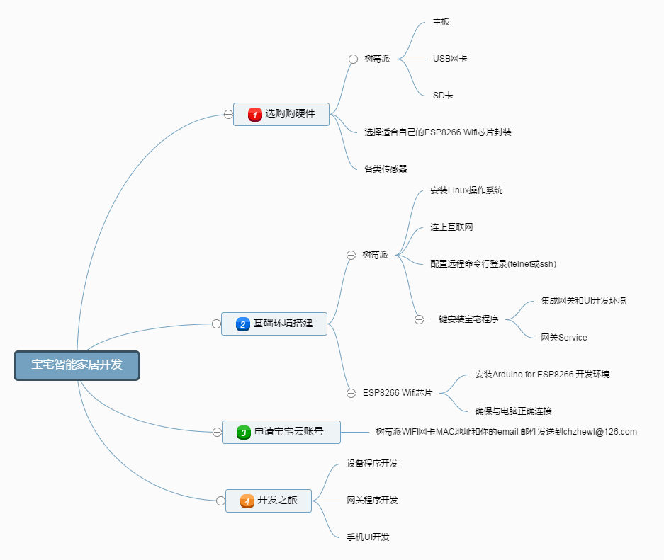
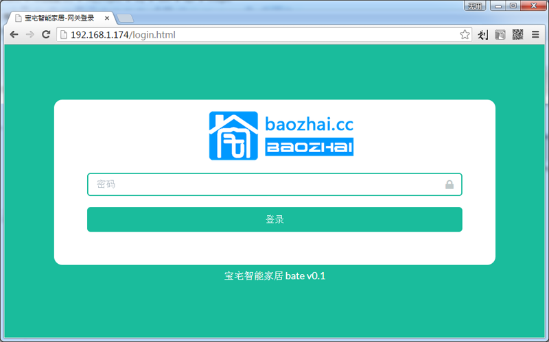
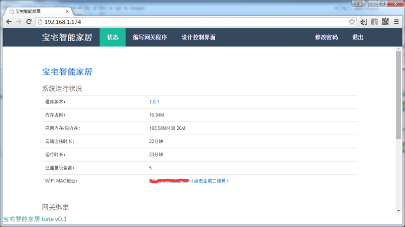
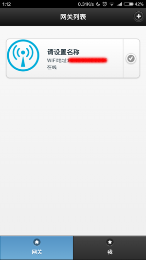

[网关程序开发](<01.md>)  
[设备程序开发](<02.md>)  
[手机控界面开发](<03.md>)   
[关于未来](<04.md>) 

#宝宅智能家居介绍

宝宅智能家居是一套简单易用而且开源的智能家居开发平台。宝宅智能家居为爱折腾的开发者们而生，目的是简化整套智能家居系统的开发复杂度，作为开发者可以将更多的精力放到到智能家居功能开发上来。
首先，我们先来看下智能家居的架构图：

从图上可以看出宝宅智能家居由4部分组成，从左向右分别是“手机端”，“云端”，“家庭网关”，“云端”和“终端设备”，下面我们先来简单了解下各个部分的作用：  
>* __“手机端”__ 通过“云端”与“家庭网关”通讯，用于实现对终端设备的监控和控制，宝宅已经实现了网络通讯等大部分功能，开发者只需要在“家庭网关”的后台管理系统上的“手机控制界面”IDE环境中通过使用HTML/CSS来设计自己想要的界面。
>* __“云端”__ 作为手机上“家庭网关”之间的桥梁，开发者无需关心。
>* __“家庭网关”__ 扮演者整个“大脑”的作用，主要代码在这里完成，主要用来连接“云端”，桥接“终端设备”和“手机端”，也可以主动给“手机端”和“终端设备”发送指令。“家庭网关”是运行在树莓派上的宝宅网程序，集成网关开发IDE和手机控制界面设计IDE,宝宅已经封装好了主要的的核心的功能，开发者只需要懂一些WEB程序开发，通过编写少量的Javascript和Html/css 就可以完成网关程序的开发和控制界面的设计。
>* __“终端设备”__ 与“家庭网关”直接连接，可能是传感器也可能是需要控制的设备，MCU采用ESP8266 WIFI芯片，接入方便，价格便宜。另外基于Esp8266 for adrduino IDE开发环境+宝宅SDK，开发者无需了解具体的芯片原理和数据通讯过程，完全可以像开发arduino程序一样来编写ESP8266 上的程序。  

###宝宅智能家居开发导向图

##开始

###1.准备好一台树莓派
>* 从淘宝上购买一台树莓派，要求最低1代，同时请购买USB无线网卡和SD卡。
>* 将树莓派刷为Linux操作系统（一般默认安装 Debian linux操作系统），准备一个刚安装好的系统环境。
>* 将树莓派连接到互联网，最好配置静态IP,建议开启telnet或ssh远程登录。

###2.运行一键安装脚本，安装宝宅网关程序
	curl http://res.baozhai.cc/install.sh | sh

当显示如下内容时表示已安装成功  

	start server  
	baozhai pid is 25042  
	Install finish!  

###3.使用浏览器（建议chrome浏览器）访问 http://你的树莓派IP/   
打开宝宅智能家居管理系统，默认进入登录界面：

输入默认密码“admin”，登录进去：

###3.申请宝宅账号
请将WIFI MAC地址和你的email账号，邮件发送chzhewl@126.com，审核通过后会邮件回复您，WIFI MAC地址用于将网关在云端注册，email账号会作为手机客户端登录云端的账号。

###4.手机客户端绑定网关
收到回复邮件后，接下来就可以开始将手机绑定网关了，请使用下述方法在手机上打开宝宅智能家居程序.
>如果您是安卓手机请扫描下面的二维码下载安卓客户端，同时宝宅也支持HTML5 WEB版的客户端在浏览器中输入[http://w.baozhai.cc](http://w.baozhai.cc) 打开HTML5版客户端（如您是苹果设备可以使用此方式）。   
>__注：安卓客户端比HTML5版具有如下优势：__  
>1.扫描二维码绑定网关(详见下文)   
>2.接收来自网关的推送消息，可以用来实现预警功能。
>   
>安卓包下载二维码    
>

1.使用邮件回复的账号的密码登录到云端  
  
2.登录后，在“网关列表”页面中点击右上角的加号按钮打开“网关绑定”页面  
   
3.回到PC浏览器上的网关后台，在“状态”页中“WIFI MAC地址”后面选择“点击生成二维码”，这时系统会为MAC地址生成一个二维码，回到手机上的“绑定网关”页面，如果是安装的安卓客户端在页面上会有一个“扫一扫”按钮，点击扫描二维码，扫描成功后MAC地址会自动输入到输入框里，如果是WEB版，可以通过微信扫描后将MAC地址复制到输入框里。

网关界面  
 

手机界面  
  
4.点击“绑定”按钮，在然后回到PC浏览器网关的“状态”页面上，下方“网关绑定”处的按钮变为可点状态，点击来确认本次绑定，这时手机上会自动完成绑定，并回到“网关列表”页面，本次绑定成功。

网关界面  
  

手机界面  
  
5.点击新增加网关列表项右侧的对勾按钮，在弹出的对话框中为当前网关定义一个名称，点击任意位置确定名称修改，至此网关绑定完成。  
  

#继续
[网关程序开发](<01.md>)  
[设备程序开发](<02.md>)  
[手机控界面开发](<03.md>) 
[关于未来](<04.md>) 

