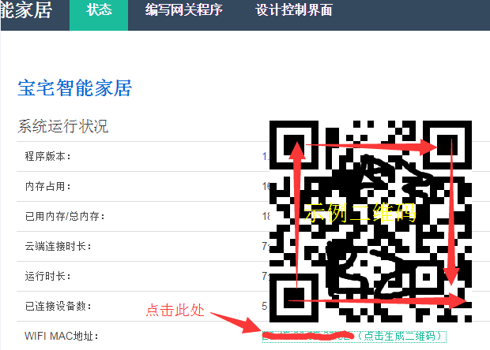
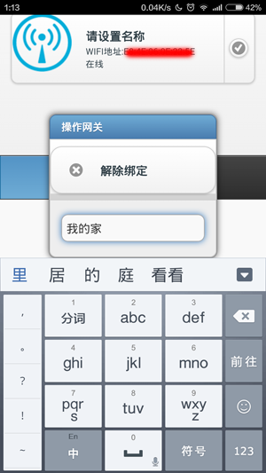
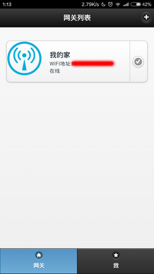

* [网关程序开发](<01.md>)  
* [设备程序开发](<02.md>)  
* [手机控界面设计](<03.md>)   
* [关于未来](<04.md>) 

##准备工作

###1.准备好一台树莓派
>* 从淘宝上购买一台树莓派，要求最低1代，同时请购买USB无线网卡和SD卡。
>* 将树莓派刷上Linux操作系统（一般默认安装 Debian linux操作系统），准备好一个干净的系统环境。
>* 将树莓派连接到互联网，建议配置静态IP，方便日后管理，开启telnet或ssh远程登录。

###2.请以__root__用户运行一键安装程序，安装宝宅网关框架程序
	curl http://res.baozhai.cc/install.sh | sh

当显示如下内容时表示已安装成功  

	start server  
	baozhai pid is 25042  
	Install finish!  

###3.打开浏览器（建议使用chrome浏览器）访问 http://你的树莓派IP/   
进入宝宅智能家居管理系统的登录界面：

输入密码“admin”，登录进去：

###3.申请宝宅账号
请将WIFI MAC地址和你的email账号，邮件发送chzhewl@126.com，并简述您的想法，审核通过后，会邮件回复您。WIFI MAC地址用于将网关在云端注册，email账号会作为手机端登录云端的账号。

###4.手机客户端绑定网关
收到回复邮件后，接下来就可以开始将手机绑定网关了，请使用下述方法在手机上运行宝宅智能家居手机端程序.
>如果您是安卓手机请扫描下面的二维码下载安装安卓客户端，如果您不是安卓手机，宝宅提供了HTML5版的客户端，在浏览器中输入[http://w.baozhai.cc](http://w.baozhai.cc) 打开HTML5版客户端（如您是苹果设备建议使用此方式）。   
>__注：安卓客户端比HTML5版具有如下优势：__  
>1.扫描二维码绑定网关(详见下文)   
>2.接收来自网关的推送消息，可以用来实现预警功能。
>   
>安卓包下载二维码    
>

1.使用审核通过后邮件回复的账号和密码登录到云端  
  
2.登录后，在“网关列表”页面上点击右上角的加号按钮进入“网关绑定”页面  
   
3.回到PC浏览器上，在“状态”页中“WIFI MAC地址”后面选择“点击生成二维码”，这时系统会为MAC地址生成一个二维码，然后在回到手机上的“绑定网关”页面，如果是安装的安卓客户端在页面上会有一个“扫一扫”按钮，点击扫描二维码，扫描成功后MAC地址会自动显示到输入框里，如果是HTML5版，可以通过微信扫描后将MAC地址复制到输入框里。

网关界面  
 

手机界面    
  
4.点击“绑定”按钮，这时绑定请求已经转发到了网关侧，回到PC浏览器的“状态”页面上，查看下方的“网关绑定”的按钮已经变为可点状态，点击来确认本次绑定，这时手机上会自动完成绑定，并回到“网关列表”页面，此次绑定完成。

PC浏览器上，点击下面的按钮同意本次绑定  
  

手机上绑定成功界面  
  
5.点击刚刚绑定好的网关项右侧的对勾按钮，在弹出的对话框中为当前网关定义一个名称，点击任意位置确定名称修改，至此网关绑定结束。  
  

* [网关程序开发](<01.md>)  
* [设备程序开发](<02.md>)  
* [手机控界面设计](<03.md>)   
* [关于未来](<04.md>) 