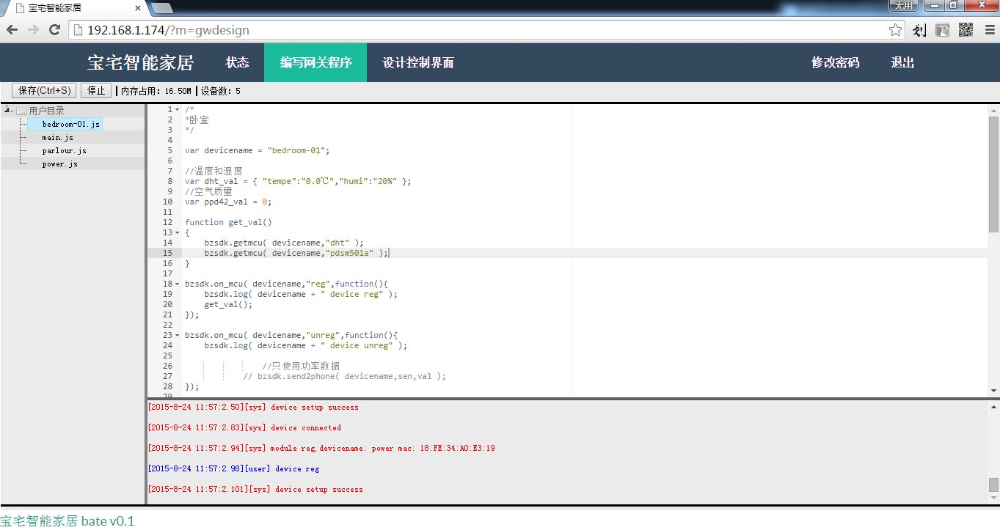

* [准备工作](<00.md>)   
* [设备程序开发](<02.md>)  
* [手机控界面设计](<03.md>)   
* [关于未来](<04.md>)  

#网关程序开发
宝宅为网关程序开发专门提供了IDE环境，用户只需要通过浏览器(建议使用chrome浏览器)登录到网关管理后台即可进行网关程序的开发，非常方便：

* 左侧是文件列表区，提供了文件的罗列、创建、打开、删除和重名功能。
* 右侧是代码编写区域，提供了最基本的`javascript`语法检测、高亮、提示等功能。
* 右侧下面部分为日志输出区域，提供日志打印输出，方便程序的调试。
* 上侧工具栏提供了“保存”按钮、停止/启动网关程序、网关程序内存占用量和当前已连接到网关的设备数量，方便程序的验证和性能检测。
* 另外还提供了定时和文件切换时自动保存的功能。

>网关程序是运行在`Node.js` 上的`javascript` 脚本程序，Node.js原生提供了非常丰富API用于程序开发，关于`Node.js`提供的API请参见其[API文档](https://nodejs.org/api/)，javascript语言相关内容请参见[javascript教程](http://www.w3school.com.cn/js)。

#我们先来看下宝宅的网关API都是怎么使用的吧

	//获取设备名为"bedroom-01"上的传感器"dht"的温度和湿度数据
	bzsdk.getdevice( "bedroom-01","dht" );
	//设置设备名为"parlour"上的传感器"315send"数值为"16697953,24"（打开客厅里的灯）
	bzsdk.setdevice( "parlour","315send","16697953,25" );
	//向手机发送当前的家里的总电器功率（单位是W）
	bzsdk.send2phone( "power","imeter",val.split(",")[2] + "W" );
	//向手机推送门磁触发消息，提醒有人开门（目前只支持android设备）
	bzsdk.push2phone( "门磁","门开了" );
	//监听设备注册到网关事件，在这里可以做一些初始化工作
	bzsdk.on_device( "parlour","reg",function(){
	    bzsdk.getmcu( "parlour","ppd42" ); //获取一次空气质量数据
	});
	//监听设备离线事件
	bzsdk.on_device( "power","unreg",function(){
	    bzsdk.log( "power device unreg" ); //打印设备离线日志
	});
	//监听来自设备传感器的数据（如果不对某个设备做监听的话，请求会自动发到绑定的手机上）
	bzsdk.on_device( "parlour","val",function( sen,val ){
		switch( sen ){
			case "315recv":{   //315接收模块
				if ( val=="2547936,24" ){  //门磁触发的数据
					//推送到手机
					bzsdk.push2phone( "门磁","门开了" );
				}
				break;
			}	
		}
	});
	//来自手机的数据获取请求（如果不对某个设备做监听的话，请求会自动发到对应的设备上）
	bzsdk.on_phone( "parlour","get",function(sen){
	    switch( sen )
	    {
	        case "dht_tempe":{  //温度数据
				//发送从设备定时取好的温度数据
	            bzsdk.send2phone( "parlour",sen, dht_val.tempe );
	            break;
	        }
	        case "dht_humi":{  //湿度数据
				//发送从设备定时取好的湿度数据
	            bzsdk.send2phone( "parlour",sen, dht_val.humi );
	            break;
	        }
	        case "ppd42":{	  //空气质量
				//发送从设备定时取好的空气质量数据
	            bzsdk.send2phone( "parlour",sen, ppd42_val );
	            break;
	        }
	    }
	});

	//来自手机的数据设置请求（如果不对某个设备做监听的话，请求会自动发到对应的设备上）
	bzsdk.on_phone( "switch-01","set",function(sen,val){
	    switch( sen )
	    {
	        case "relay":{  //继电器
				//转发到设备上
	            bzsdk.setdevice( "switch-01",sen, val );
	            break;
	        }
	    }
	});

#宝宅网关API

接下来针对每个API分别做个详细的说明。

##bzsdk.getdevice(device,sensor)
>作用：用于向设备请求获取数据
>
- device：要获取数据的设备名
- sensor：要获取数据的传感器名

>示例代码：
>
	//请求设备名为"bedroom-01"上的传感器"dht"的温度和湿度数据
	bzsdk.getdevice( "bedroom-01","dht" );

##bzsdk.setdevice(device,sensor,value)
>作用：用于向设备请求设置数据
>
- device：要设置数据的设备名
- sensor：要设置数据的传感器名
- value：要设置的数据

>示例代码：
>
	//设置设备名为"parlour"上的传感器"315send"数据为"16697953,24"（打开客厅里的灯）
	bzsdk.setdevice( "parlour","315send","16697953,25" );

##bzsdk.send2phone(device,sensor,value)
>作用：用于向手机发送某个设备上的某个传感器获取到的数据
>
- device：设备名
- sensor：传感器名
- value：数据

>示例代码：
>
	//向手机发送当前的家里的总电器功率（单位是W）
	bzsdk.send2phone( "power","imeter",val.split(",")[2] + "W" );

##bzsdk.push2phone(tile,message)
>作用：用于向手机推送消息，推送到的消息会在手机通知栏中出现（目前只支持android设备）
>
- tile：消息标题
- message：消息内容

>示例代码：
>
	//向手机推送门磁触发消息，提醒有人开门
	bzsdk.push2phone( "门磁预警","有人开门了" );

##bzsdk.log(...)
>作用：打印日志到控制台
>
- 可以传递多个参数

>示例代码：
>
	bzsdk.log("devicename:" + devicename);	
	bzsdk.log("devicename:",devicename);
	
##bzsdk.on_device(devicename,"reg",callback)
>作用：监听设备注册到网关的事件，在这里可以做一些初始化工作
>
- devicename：设备名称
- callback：回调函数

>示例代码：
>
	bzsdk.on_device( "parlour","reg",function(){
	    bzsdk.getmcu( "parlour","ppd42" ); //向设备请求获取一次空气质量数据
	});

##bzsdk.on_device(devicename,"unreg",callback)
>作用：监听设备离线事件，在这里可以做一些数据重置的处理
>
- devicename：设备名称
- callback：回调函数

>示例代码：
>
	bzsdk.on_device( "parlour","unreg",function(){
	    bzsdk.log("parlour device unreg!!!"); //打印消息
	});

##bzsdk.on_device(devicename,"val",callback(sensor,value) )
>作用：监听来自设备的数据，如果不对某个设备做监听的话，请求会自动发到__绑定的手机上__
>
- devicename：设备名称
- callback：回调函数
	- sensor：传感器名
	- value：数据

>示例代码：
>
	//监听来自设备传感器的数据
	bzsdk.on_device( "parlour","val",function( sen,val ){
		switch( sen ){
			case "315recv":{   //315接收模块
				if ( val=="2547936,24" ){  //门磁触发的数据
					//推送到手机
					bzsdk.push2phone( "门磁预警","有人门开了" );
				}
				break;
			}	
		}
	});

##bzsdk.on_phone(devicename,"get",callback(sensor,value) )
>作用：监听来自手机的数据获取请求，如果不对某个设备做监听的话，请求会自动发到__对应的设备上__
>
- devicename：设备名称
- callback：回调函数
	- sensor：传感器名
	- value：数据

>示例代码：
>
	bzsdk.on_phone( "parlour","get",function(sen){
	    switch( sen )
	    {
	        case "dht_tempe":{  //温度数据
				//发送从设备定时取好的温度数据
	            bzsdk.send2phone( "parlour",sen, dht_val.tempe );
	            break;
	        }
	        case "dht_humi":{  //湿度数据
				//发送从设备定时取好的湿度数据
	            bzsdk.send2phone( "parlour",sen, dht_val.humi );
	            break;
	        }
	        case "ppd42":{	  //空气质量
				//发送从设备定时取好的空气质量数据
	            bzsdk.send2phone( "parlour",sen, ppd42_val );
	            break;
	        }
	    }
	});

##bzsdk.on_phone(devicename,"set",callback(sensor,value) )
>作用：监听来自手机的数据设置请求，如果不对某个设备做监听的话，请求会自动发到__对应的设备上__
>
- devicename：设备名称
- callback：回调函数
	- sensor：传感器名
	- value：数据

>示例代码：
>
	bzsdk.on_phone( "switch-01","set",function(sen,val){
	    switch( sen )
	    {
	        case "relay":{  //继电器
				//转发到设备上
	            bzsdk.setdevice( "switch-01",sen, val );
	            break;
	        }
	    }
	});

#资料

[node.js api文档](https://nodejs.org/api/)  
[javascript教程](http://www.w3school.com.cn/js)