[网关程序开发](<01.md>)  
[手机控界面开发](<03.md>)  
[关于未来](<04.md>) 

#设备程序开发

宝宅的设备基于ESP8266 WIFI芯片开发，esp8266 具有以下优势：

1. WIFI通信。
2. 多种封装、价格低廉（淘宝上最便宜的还不到￥10)
3. 官方开放SDK，可做二次开发，文档和资料非常详细。

当然用官方提供的SDK做二次开发还是存在一定难度的，宝宅的目的是降低开门槛，让开发者更容易上手，把更多的精力放到智能家居功能本身，而不是把精力花费在繁琐的开发环境搭建、固件编译上传和技术趟坑上。

在这里非常感谢[@Ivan Grokhotkov](https://github.com/igrr)大神，他为我们提供了简单易用的 Arduino IDE for ESP8266，让这件事情变的简单了很多，他将arduino IDE和esp8266 sdk 整合到了一块，我们完全可以像开发arduino那样开发esp8266程序，而且可以复用现有的几乎所有的arduino三方库，非常方便，[介绍文档](https://github.com/esp8266/Arduino/blob/master/doc/reference.md)， [Github](https://github.com/esp8266/Arduino) 。

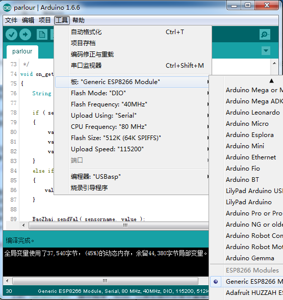

宝宅为了进一步简化智能家居的开发难度，在此基础上提供了 BaoZhai库，开放者无需关心具体的通讯细节，只需要调用 BaoZhai库提供的相关API即可 ，[Github]()。下载后将 BaoZhai目录放到 “libraries” 目录后重启arduino 就可以用了。 
>建议直接下载已经编译好的 Windows 下的 Arduino IDE for ESP8266，已经包含 BaoZhai库和其他常用的arduino 三方库，[下载地址](http://pan.baidu.com/s/1o6VO8K6)。

#准备工作
###1.选购适合你的esp8266模块吧

esp8266 官方的封装：

esp-201 全IO口引出版：

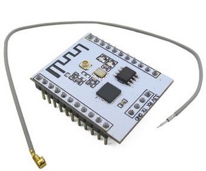

Nodemcu版：

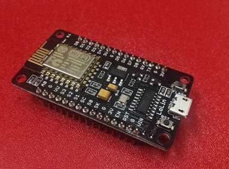

>研发时建议选择esp-01、esp-201或Nodemcu，NodeMcu类似arduino UNO，全IO口输出，不需要额外的下载器和供电，USB连接电脑就可以用Arduino IDE for ESP8266给它下载程序和调试了，缺点是价格相对高，体积大，不适合放到小的空间内。  
esp-01、esp-201 可以连接2.54mm杜邦线，免去焊接，通过简单的插接就可以与下载器、电源和其他传感器连接，不同之处是eps-01只引出重要的8个引脚，esp-201全IO口引出。
使用esp-01和esp-201 开发时需要一个USB转TTL的模块用作下载器，建议FT232RL芯片，且全IO引出：

>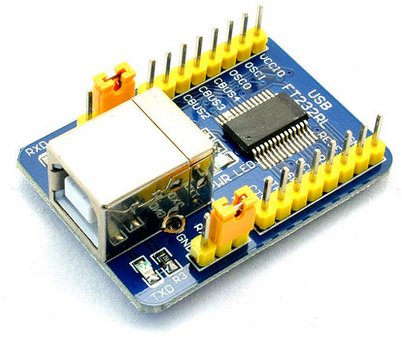

>[文档](https://github.com/esp8266/Arduino/blob/master/doc/boards.md) 详细介绍了下FT232RL模块 与 esp8266 的连接方法。  
>另外，你还需要一款3.3v 的电源模块，因为esp8266芯片对电源的要求是3.3V and >= 250mA，这里推荐AC220V转5v和3.3v 700ma 的电源模块（购买时可以要求卖家焊接引脚），既可以用于调试供电，也可以用于后续设备的长期供电，当然有条件的可以使用可调的直流稳压电源用做调试供电，电源模块：

>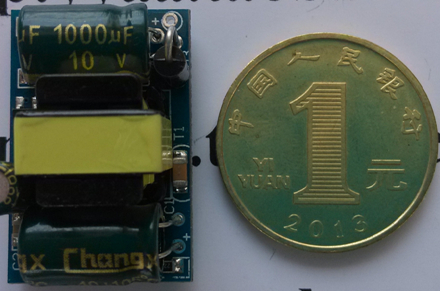

###2.购买一些辅助工具，你会用的着的
  
泡沫板：  

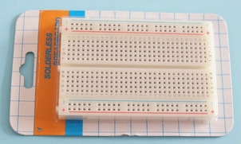

杜邦线：

    
淘宝上类似的实用工具套装：  

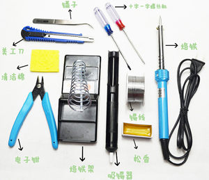

#BaoZhai API

BaoZhai库的核心API 2个，回调函数4个，我们来看一下。

##BaoZhai.begin( devicename,ssid,pass,on\_reg,on\_unreg,on\_get,on\_set );
>作用：初始库 BaoZhai库
>
- devicename：设备名称，自定义，不能为空，注意同个网关下不能出现同名   
- ssid：WIFI账号
- pass：WIFI密码
- on\_reg：与网关连接成功回调函数 
- on\_unreg：与网关断开连接回调函数
- on\_get：网关请求获取数据，如获取开关当前状态
- on\_set：网关请求改变数据，如设置开关当前状态

>示例代码：
>
	//初始化宝宅
	BaoZhai.begin( "switch", "xxxx", "123", on_reg, on_unreg, on_get, on_set );

##BaoZhai.sendVal( sensorname, value );
>作用：向网关发送某个传感器的数据
>
- sensorname：传感器名称，自定义，可以为空  
- value：传感器数据

>示例代码：
>
    //发送通过dht22传感器取到的温度和湿度数据（逗号间隔）
    BaoZhai.sendVal( "dht22", "24.5,85.2" );

##on_reg()
>作用：与网关连接成功时回调函数

>示例代码：
>  
	void on_reg( )
	{
	  //初始化开关状态（高电位关）
	  digitalWrite(SWITCH_PIN, HIGH);
	  switch_status = HIGH;
	}

##on_unreg()
>作用：与网关断开连接时回调函数

>示例代码：
>  
	void on_unreg()
	{
	  //初始化开关状态（高电位关）
	  digitalWrite(SWITCH_PIN, HIGH);
	  switch_status = HIGH;
	}

##onget( sensorname )
>作用：来自网关的数据获取请求回调函数
>
- sensorname：要请求数据的传感器名称，可以为空  

>示例代码：
>  
	void on_get( const String& sensorname )
	{ 
		String value;	
		if ( sensorname=="dht22" )  //dht22温湿度传感器
		{
			 value = dht_humidity;
			 value += ",";
			 value += dht_temperature;
		}
		else if ( sensorname=="ppd42" ) //ppd42空气质量传感器
		{
			value = concentration;
		}
		//回应请求数据
		BaoZhai.sendVal( sensorname, value );
	}

##onset( sensorname,value )
>作用：来自网关的数据获取请求回调函数
>
- sensorname：要请求改变数据的传感器名称，可以为空  
- value：要请求改变的数据

>示例代码：
>  
	void on_set( const String& sensorname,
	             const String& value )
	{
	    if ( sensorname=="315send" ) //315MHz 发送
	    {
	      int s = value.indexOf(',');
	      if ( s!=-1 )
	      {
	          String tmp  = value.substring(0,s);
			  //获取发送内容
	          unsigned long code_num = (unsigned long)tmp.toInt();
	          tmp = value.substring(s+1); 
			  //获取内容长度
	          unsigned long bit_num = (unsigned long)tmp.toInt(); 	          
	          send_Switch.send( code_num,bit_num ); //发送	
	          BaoZhai.sendVal( sensorname, value ); //回应发送结果
	      }      
	    }
	}

#起航，实现继电器控制（智能插座）

*	ESP8266连接电脑，上电（不明白的请阅读[文档](https://github.com/esp8266/Arduino/blob/master/doc/boards.md) ）。
*	运行 arduino.exe 打开 Arduino IDE for ESP8266 集成开发环境。
*	选择　“文件”->“示例”->“BaoZhai”->“switch” 示例Demo。
*	选择	 “工具”->“板...”->对应的ESP8266版本，如果是esp-01和esp-201请选择“Generic ESP8266 module”。
*	在代码中配置好你的无线路由器的账号的密码，将代码另存为一份。
*	点击编译上传按钮。

改造好的智能插座：  
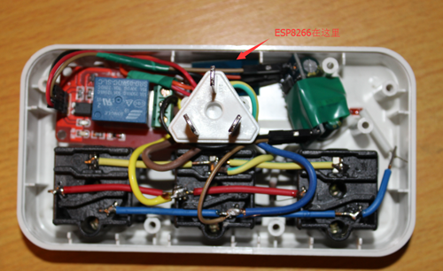  
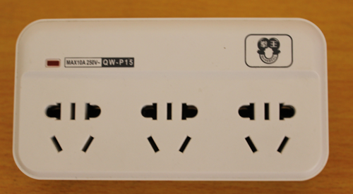

###其他设备

客厅温湿度、空气质量、315MHz发射/接收、人体红外集成设备:  

改造饮水机：  
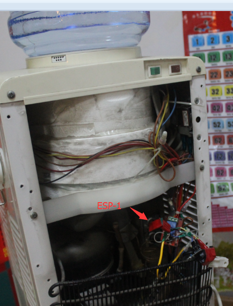

红外学习（控制电视、空调）：  
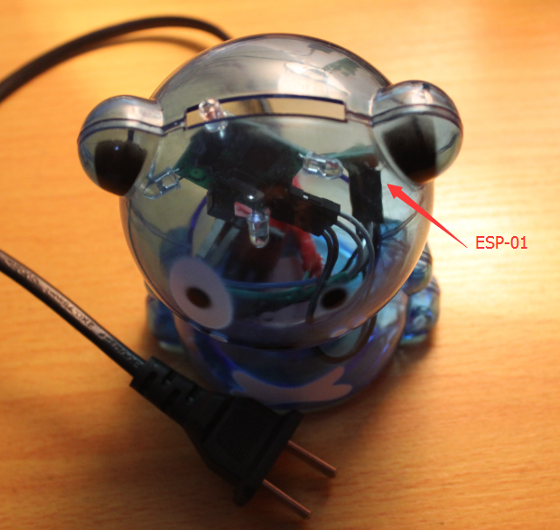

家庭能耗：  

小车：  
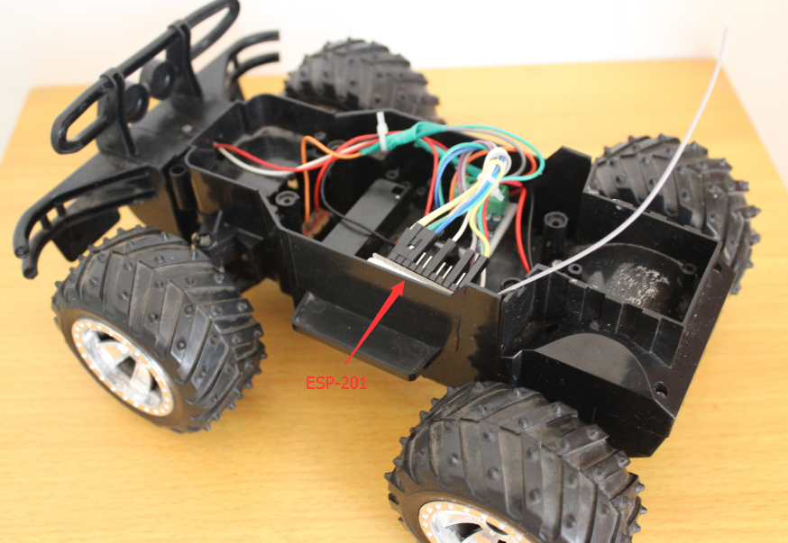

查看[网关程序的编写]()和[手机UI的设计]()

#资料
*	[Arduino IDE for ESP8266 介绍](https://github.com/esp8266/Arduino/blob/master/doc/reference.md)
*	[Arduino IDE for ESP8266 支持硬件](https://github.com/esp8266/Arduino/blob/master/doc/boards.md)
*	[ESP8266 官方论坛](http://bbs.espressif.com/)
*	[Arduino精华，很详细的arduino教程，其中很多例子可以直接在esp8266上使用](http://www.geek-workshop.com/portal.php?mod=list&catid=1)
*	[Arduino官方教程](https://www.arduino.cc/en/Tutorial/HomePage)
*	[Nodemcu官方网站](http://www.nodemcu.com/index_cn.html)