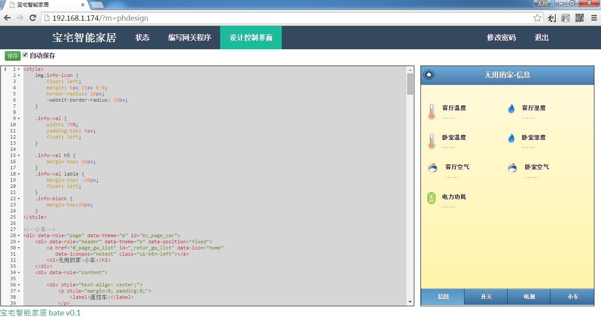

[网关程序开发](<01.md>)  
[设备程序开发](<02.md>)   
[关于未来](<04.md>) 

#手机控界面开发

宝宅为手机界面开发专门提供了IDE环境，用户只需要通过浏览器(建议使用chrome浏览器)登录到网关管理后台即可进行手机界面的开发，非常方便：

* 左侧为界面描述代码编写区域，基于HTML和CSS代码，下面我们会做详细的介绍。
* 右侧为界面实时效果预览区域，在左侧更改的效果在右侧可以实时看到。

#开发
宝宅手机界面开发类似WEB程序开发，基于HTML5/CSS3、jquery mobile定制，你只需要懂一些HTML/CSS基础语法和jquery mobile 基础知识就可以很容易上手宝宅的界面开发了。

##我们先看一下如何做一个简单的界面吧
###代码：
	

	  

	    
	    <h1>我的家</h1>
	  

	  

		    

		        <label for="switch">插座:</label>
		        <select id="switch" 
		          data-role="slider" disabled="disabled" 
		          data-track-theme="c" data-theme="b" 
		          data-device="switch" data-sensor="none">
		            <option value="off">关</option>
		            <option value="on">开</option>
		        </select>
		   

		   

		        <h1>宝宅智能家居2015</h1>
		   

	  

	

###效果：

我们一起来分析下上面的代码：  

###先看下最外层的DIV  

	

这是Jquery Mobile界面元素的写法，来看下每个字段的含义：  

* data-role="page" jquery mobile中表示这个DIV是一个页面。
* data-theme="e" jquery mobile中表示当前页面的主题风格，目前共有a-e 5个级别。
* id="bz_page_home" 用于表示这个DIV元素的ID号，__这里需要注意的是在宝宅界面中必须有一个page页的id为“bz_page_home”,宝宅会优先加载这个id的页面作为首页，如果没有会导致无法正常显现控制界面。__

###我们看下最关键的地方，插座的控制控件的描述
	<select id="switch" data-role="slider" disabled="disabled" data-track-theme="c" data-theme="b" data-device="switch" data-sensor="none">
		<option value="off">关</option>
		<option value="on">开</option>
	</select>

同样，这也是Jquery Mobile界面元素的写法，来看下每个字段的含义：  

* data-role="slide" jquery mobile中滑动条控件。
* disabled="disabled" 默认不可操作，灰色，在手机上运行时，宝宅检测到对应的设备上线时会修改为可用状态。
* data-device="switch"  __重点参数，用于表示这个控件对应的设备名称__
* data-sensor="none"  __重点参数，用于表示这个控件对应的传感器名称__
* option 标签的value="off" __重点参数，当操作到对应的状态时要发给网关的数据__

综述起来其实非常简单，就是当控件的状态发生变化时，宝宅会按照 “data-device”、“data-sensor”和“value”配置好的内容将设备名称、传感名称和要改变的数据发给网关，网关在转发给对应的设备上，以此来实现设备的控制。

其他代码在这里我们不做详细的介绍了，详细内容请翻阅[HTML/CSS 教程](http://www.w3school.com.cn/h.asp)  和 [Jquery Mobile 教程](http://www.w3school.com.cn/jquerymobile/jquerymobile_pages.asp)

#看下手机上的效果

#控件API

##标签
	<lable data-role="lable"  data-device="devicename" data-sensor="sensorname"/>
>__作用__：在初始化和对控件点击时请求展示传感器的数据
>
- data-role="lable"：必须，代表此元素是一个标签
- data-device="devicename"：要获取数据的设备名称
- data-sensor="sensorname"：要获取数据的传感器名称

>示例代码：
>
	<h5>客厅温度</h5>
	<lable data-role="lable"  data-device="parlour" data-sensor="dht_tempe">……</lable>

##普通按钮
	<button data-role="button" data-device="devicename" data-sensor="sensorname" data-tapval="xxx"  data-downval="xxx" data-upval="xxx"/>
>__作用__：在按钮按下时请求设备传感器的数据
>
- data-role="button"：必须，代表此元素是一个按钮
- data-device="devicename"：要获取数据的设备名称
- data-sensor="sensorname"：要获取数据的传感器名称
- data-tapval="xxx"：按钮点击时向网关发送的数据（可选）
- data-downval="xxx"：按钮按下时向网关发送的数据（可选）
- data-upval="xxx"：按钮弹起时向网关发送的数据（可选）

>示例代码：
>
	<button data-role="button"  data-icon="delete" data-theme="e"  data-iconpos="top "  data-corners="true" data-mini="true" data-device="iremote-01" data-sensor="send" data-tapval="1" disabled="disabled">静音</button>

##滑动按钮
	<select  data-role="slider" data-device="devicename" data-sensor="sensorname">
		<option value="xxx1">关</option>
		<option value="xxx2">开</option>
	</select>

>__作用__：在滑动按钮状态变化时请求设置设备传感器的数据
>
- data-role="slider"：必须，代表此元素是一个滑动按钮
- data-device="devicename"：要获取数据的设备名称
- data-sensor="sensorname"：要获取数据的传感器名称
- option value="xxxx"：选中当前状态是向网关发送的数据

>示例代码：
>
	<label for="drinking-01">饮水机:</label>
	<select name="slider" id="drinking-01" data-role="slider"  disabled="disabled" data-track-theme="c" data-theme="b" data-device="drinking-01" data-sensor="none">
		<option value="off">关</option>
		<option value="on">开</option>
	</select>

#资料
[HTML/CSS 教程](http://www.w3school.com.cn/h.asp)  
[Jquery Mobile 教程](http://www.w3school.com.cn/jquerymobile/jquerymobile_pages.asp)